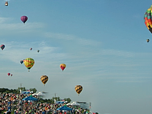

# A Patch-based algorithm for high quality and diversity single Image Generation

This is the official implementation for our paper presented at ICIP 2022:

**A Patch-based algorithm for high quality and diversity single Image Generation**
N. Cherel, A. Almansa, Y. Gousseau, A. Newson

We present a pure patch-based solution to single image generation that does not require learning.
As a result new samples are possible using this code in a few seconds.

Reference | Generated
:--------:|:---------:
 | 

# Install

The requirements are:
- opencv
- numpy
- scipy
- cffi
- numba


## Accelerate
You can accelerate processing by compiling the source file `patch_measure.cpp` with the following command (tested on Linux only):
```
g++ -fPIC -shared patch_measure.cpp -O3 -o libpatch_measure.so
```
And then activate it in `config.py` with `USE_CPP=True`.


## Run

The code is then run using :
```
python synthesis.py
```

The default file used as reference is available is `balloons.png`.

